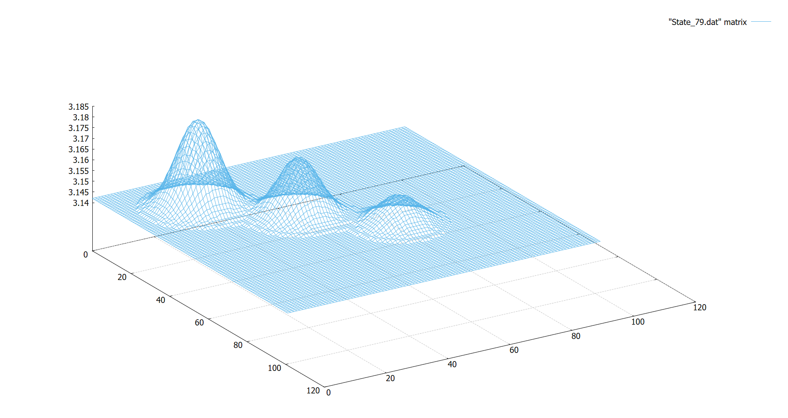

Audiencia
=========

Estudiantes de doctorado del Instituto de Hidrología de Llanuras, `IHLLA <https://ihlla.conicet.gov.ar/>`_, 
y de otros centros de investigación o universidades, no necesariamente argentinos, pero relacionados con Hidrología, Sensores Remotos, 
Simulación Numérica de Recursos Hídricos, Evaluación de Riesgo de Desastres Naturales o Sistemas de Alerta Temprana.  

Se impartirá en castellano, aunque gran parte de la documentación de soporte y links están en inglés. Todo el software empleado y los
accesos a recursos en internet están en abierto.

Se piensa en sesiones de 4 horas cada una, una o dos por semana, en horario de oficina,  huso UTC-3.

Objetivos
---------
Revisar conceptos básicos de Hidrología para introducirse en la modelización y explotación de datos con las técnicas más recientes, y adquirir autonomía para trabajar con:

* Imágenes satelitales en abierto trabajando con servidores en la nube: Google-Earth-Engine.

* Uso de librerías y software abierto: Python, JavaScript, R, Linux shells.

Como ejemplo práctico de integración se estudiarán los casos: 

* Inundaciones a gran escala: modelos digitales de elevación y simulaciones numéricas con el soporte de imágenes satelitales.

* Inteligencia Artificial y Machine-Learning: pronóstico de series temporales de caudal con redes neuronales LSTM.

* Casos a discutir en la propia cuenca del Azul (DACB, Del Azul Creek Basin).

Requisitos
----------
Conocimientos básicos de Hidrología y programación, aunque se dará un curso previo de inmersión a `Python <https://www.python.org/>`_ 
y `JavaScript de Google-Earth-Engine <https://developers.google.com/earth-engine/tutorials/tutorial_js_01>`_ 

Inicio y duración
-----------------
Previsiblemente a partir de mitad de Septiembre de 2023, y de 30 horas de duración.

Organización de las sesiones
-----------------------------

Primer día, 4h:
***************

* Teoría básica de ecuaciones de conservación en derivadas parciales: clasificación, discretización, términos fuente, condiciones contorno, estabilidad.
* Nociones básicas de programación, uso de lenguaje Python para las EDP seleccionadas.
* Manipulación de series temporales con Python, utilidades para cambio de formato e intervalos de tiempo. Tendencias, estacionalidad y predicción con un modelo regresivo como PROPHET.

Días 2º, 3º, 4º, 12h:
*********************
* Introducción a GEE.
* Detección de cuerpos de agua con GEE e imágenes satelitales MSI:
 * Bases de datos globales: JRC y GFDB. Barridos anuales para detectar cambios en un área de interés.
 * Indice NDWI, clasificación por valor umbral, distribución de Otsu.
 * Caso particular: reservorios.
 * Clasificadores con entrenamiento no supervisados.
 * Clasificadores con entrenamiento supervisados.
 * Cruzado con MDE para calcular volúmenes de agua.

.. image:: ./Pics/Steps_Donchyts_2023.png
  :width: 300
  :alt: Steps_World-Watch
  :align: center 

 

* Análisis de precipitación diaria en grilla de 0.05° con la misión satelital `CHIRPS`_, y con la misión `GPM-IMERG`_ de grilla 0.1° e intervalo de 30 minutos. Series temporales.

.. _CHIRPS: https://developers.google.com/earth-engine/datasets/catalog/UCSB-CHG_CHIRPS_DAILY

.. _GPM-IMERG: https://developers.google.com/earth-engine/datasets/catalog/NASA_GPM_L3_IMERG_V06 

* Seguimiento de sequías con el índice *NDVI* (Normalized Difference Vegetation Index).

Quinto día, 4h:
***************
* Análisis de Riesgo: Exposición && Vulnerabilidad.
* Revisiones de casos de interés previamente discutidos.
* Análisis del paper de `Houspanossian et al, 2023 <https://www.science.org/doi/10.1126/science.add5462>`_.
* Introducción a los temas avanzados:
 
 * Procesado de imágenes satelitales SAR para inundaciones urbanas: `Islam and Meng, 2022 <https://doi.org/10.1016/j.jag.2022.103002>`_.
 * Separación de dominios computacionales para GPUs. 
 * Clasificadores entrenando redes neuronales convolucionales: U-Net.

6º-7º día, 8h:
**************

* Uso de drones para obtener Modelos Digitales de Elevación para determinar zonas inundables. Teoría básica de Structure-From-Motion. Filtrado del Modelo Digital de Superficie.

* Caso particular de Azul, Tesina de Maestría de Crysthian Sánchez. Tabla comparativa de las tecnologías involucradas.

* Software `Open-Drone-Map`_, práctica con los ejemplos: opción *fast-orthophoto* para georeferenciar un cuerpo de agua, relevamiento del puente de avenida Pellegrini sobre el Arroyo Azul.

.. _Open-Drone-Map: https://www.opendronemap.org/

* Introducción a LSPIV para medir el campo de velocidad de la superficie libre de un fluído.

* Práctica con software LSPIV `RIVeR <https://riverdischarge.blogspot.com>`_ basado en Matlab. 

8º-9º día, 8h:
***************

* Modelización Hidrodinámica 2D en escala urbana con las ecuaciones de Saint Venant y HEC-RAS.

* Modelización Hidrodinámica a gran escala, soporte satelital y ecuación de onda difusiva de Lisflood-FP.

* Introducción al acoplamiento con agua subterránea.

