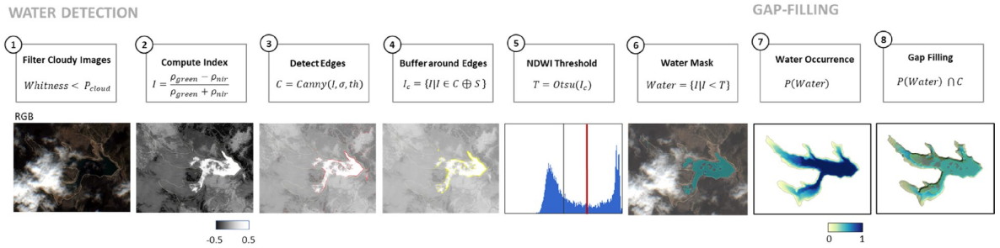

Audiencia
=========

Estudiantes de doctorado del Instituto de Hidrología de Llanuras, `IHLLA <https://ihlla.conicet.gov.ar/>`_, 
y de otros centros de investigación o universidades, no necesariamente argentinos, pero relacionados con Hidrología, Sensores Remotos, 
Simulación Numérica de Recursos Hídricos, Evaluación de Riesgo de Desastres Naturales o Sistemas de Alerta Temprana.  

Se impartirá en castellano, aunque gran parte de la documentación de soporte y links están en inglés. Todo el software empleado y los
accesos a recursos en internet están en abierto.

Se piensa en sesiones de 3 horas cada una,  dos por semana, en horario de oficina,  huso UTC-3.

Objetivos
---------
Revisar conceptos básicos de Hidrología para introducirse en la modelización y explotación de datos con las técnicas más recientes, y adquirir autonomía para trabajar con:

* Imágenes satelitales en abierto trabajando con servidores en la nube: Google-Earth-Engine.

* Uso de librerías y software abierto: Python, JavaScript, R, Linux shells.

Requisitos
----------
Conocimientos básicos de Hidrología y programación, aunque se dedicarán unas horas de inmersión a `Python <https://www.python.org/>`_ 
y `JavaScript de Google-Earth-Engine <https://developers.google.com/earth-engine/tutorials/tutorial_js_01>`_ 

Inicio y duración
-----------------
Comienza el 10 de Octubre de 2023, 10:00 am (UTC-3), se imparte en sesiones de tres horas, dos por semana (Martes y Jueves), con un total de 30 horas de duración, en modalidad híbrida presencial y remota.

Docentes
---------
`Ignacio Villanueva <ivillanueva@ihlla.org.ar>`_ y `Ailé Golin <agolin@ihlla.org.ar>`_.

Sesiones primer bloque
----------------------

10 Octubre: *Python*
********************

* Presentación del curso: alcances, objetivos, estructura de cursado y trabajo en clases, condiciones de evaluación. 
* Problema de partida: inundaciones en la llanura pampeana.
* Nociones básicas de programación, uso de lenguaje *Python* para la ED de balance vertical de una laguna.
 
* Presentación del caso particular de `Martín Blanco <martinblanco@ihlla.org.ar>`_: procesado de datos Hidro-Meteorológicos `GFS`_.
* Habilitación de Windows-Subsystem para Linux con Ubuntu, para ejecutar transferencia de ficheros con *wget*, y códigos de cálculo como *SWAT* y *Lisflood-FP*.

.. _GFS: https://developers.google.com/earth-engine/datasets/catalog/NOAA_GFS0P25

.. image:: ./Pics/DJI_0484.JPG
  :width: 280
  :alt: Finca_Elissondo_Ups
  :align: left 

.. image:: ./Pics/DJI_0508.JPG
  :width: 280
  :alt: Finca_Elissondo_Mid
  :align: center

12 Octubre: *Python ampliado*
*****************************

* Verificación del Set-Up de WSL con Ubuntu. `Solución Powershell 7.3.8 <https://github.com/PowerShell/PowerShell/releases>`_

* Resolución del caso particular: procesado de datos Hidro-Meteorológicos GFS.

* Descarga de `Open-Drone-Map v3.2.1 <https://github.com/OpenDroneMap/ODM>`_ y ficheros de imágenes de testeo, lago Güemes.

* Ampliación del código Python de balance en la vertical para una laguna. Realización del informe.

.. * Revisión de dimensionalidad espacial en modelización hidrológica.
.. * Magnitudes involucradas en una rotura de presa ideal.
.. * Código 2D onda difusiva explícito, extensión a GPU.
.. * Manipulación de series temporales con *Python*, utilidades para cambio de formato e intervalos de tiempo.
.. * Iniciación básica al entorno y lenguaje *R*.
.. * Correlación, tendencias, estacionalidad y predicción de series temporales con *R*.

* Revisión de dudas, comentarios y preparación para la siguiente semana. Verificación de la primera ejecución con Open-Drone-Map.

Sesiones segundo bloque
------------------------
17 de Octubre: *Open-Drone-Map*
*********************************
* Descarga e instalación de QGIS en caso de no tener GIS, descarga de imágenes del Puente de Pellegrini.

* Revisión de la salida de *ODM* con opción *fast-orthophoto* para georeferenciar en 2D un cuerpo de agua como el lago Güemes.

* Ejecución con *ODM* del relevamiento 3D del Puente de Pellegrini con pixel de un metro para DSM y DTM.

* Presentación del caso particular de `Camila Gregorini <cgregorini@ihlla.org.ar>`_: ploteando magnitudes adimensionales.

* Sensibilidad del DTM a los parámetros de calidad y de filtro *SMRF* de *ODM*.

19 de Octubre:  procesado *LSPIV*
*********************************
* Descarga e instalación de `RIVeR <https://riverdischarge.blogspot.com>`_, con librería MATLAB runtime.

* Teoría básica de Structure-From-Motion y revisión de los procesados previos con *ODM*, análisis de nubes de puntos con `Meshlab <https://www.meshlab.net>`_

* Presentación del caso particular de `Ninoska Briceño <nbriceno@ihlla.org.ar>`_: balance en una cubeta.

* Ajuste de curvas por mínimos cuadrados con *R*.

* Introducción a LSPIV para medir el campo de velocidad de la superficie libre de un fluído.

* Práctica con software LSPIV *RIVeR* basado en Matlab, caso puente A2.

Sesiones tercer bloque
----------------------
24 Octubre:  Inicio modelado *HD-2D*
************************************

* Segunda parte del procesado LSPIV con *RIVeR* para el puente A2.

* Introducción al `Flood-Mapping <https://floodmapping.readthedocs.io>`_.

* Modelización Hidrodinámica 2D en escala urbana con las ecuaciones de Saint Venant y `HEC-RAS <https://www.hec.usace.army.mil/software/hec-ras/>`_, caso particular de Azul, Tesina de Maestría de Crysthian Sánchez. Tabla comparativa de las tecnologías involucradas.

26 de Octubre: *Salida Campo*
***********************************

* Salida de campo para comparar diversas formas de aforo: mecánico frente a video con celular y drone.

31 de Octubre:
**************

* Revisión de los aforos con LSPIV en La Firmeza.

* Caso particular del Atuel-Salado con software open-source, Tesis Doctoral de `Ramiro Páez <ramiropaezcampos@hotmail.com>`_.

2 de Noviembre:
***************

* Configuración de escenarios GLOF (*Glacial Lake Outburst Flood*), presentado por `Matías Maino <matiasmaino@ihlla.org.ar>`_ y `Daniela Schmidt <danielainesschmidt@gmail.com>`_:

 * Dinámica del deslizamiento de masas por laderas.

* Continuación del modelo HEC-RAS 2D de Azul básico (conservación masa, breaklines) y avanzado (opciones SWE, CFL, modificaciones terreno, puentes, lluvia, etc.).

Enlaces del software de descarga y Datos compartidos
----------------------------------------------------

`Python <https://www.python.org/downloads/>`_
`GNUPLOT <http://www.gnuplot.info/download.html>`_
`R <https://cran.r-project.org/mirrors.html>`_
`Ubuntu Windows-Subsystem for Linux <https://ubuntu.com/tutorials/install-ubuntu-on-wsl2-on-windows-11-with-gui-support#1-overview>`_
`Open-Drone-Map <https://www.opendronemap.org>`_
`QGIS <https://qgis.org/es/site/forusers/download.html>`_
`RIVeR <https://riverdischarge.blogspot.com>`_
`HEC-RAS <https://www.hec.usace.army.mil/software/hec-ras/>`_

`DATOS compartidos <https://drive.google.com/drive/folders/15ARUpgfTBoDtow_7eJFdGk0IDwPYGC-_?usp=sharing>`_

Cuarto bloque (pospuesto a 2024): *Google-Earth-Engine*, 30h
-------------------------------------------------------------
* Introducción a Google-Earth-Engine.
* Detección de cuerpos de agua con GEE e imágenes satelitales MSI:
 * Bases de datos globales: JRC y GFDB. Barridos anuales para detectar cambios en un área de interés.
 * Indice NDWI, clasificación por valor umbral, distribución de Otsu.
 * Caso particular: reservorios.
 * Clasificadores con entrenamiento no supervisados.
 * Clasificadores con entrenamiento supervisados.
 * Cruzado con MDE para calcular volúmenes de agua.

 

* Análisis de precipitación diaria en grilla de 0.05° con la misión satelital `CHIRPS`_, y con la misión `GPM-IMERG`_ de grilla 0.1° e intervalo de 30 minutos. Series temporales.

.. _CHIRPS: https://developers.google.com/earth-engine/datasets/catalog/UCSB-CHG_CHIRPS_DAILY

.. _GPM-IMERG: https://developers.google.com/earth-engine/datasets/catalog/NASA_GPM_L3_IMERG_V06 

* Seguimiento de sequías con el índice *NDVI* (Normalized Difference Vegetation Index).
