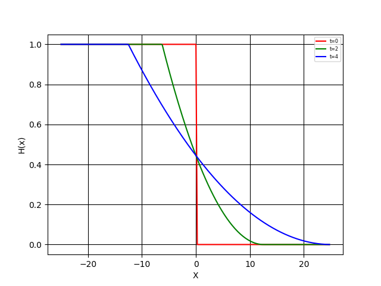

PP o Python Practicum
=====================

Inicialmente se introducen los conceptos generales de programación: declaración de variables, definición de valores, operadores condicionales, bucles, uso de librerias matemáticas, gráficas y entrada y salida de datos por ficheros.
Posteriormente y relacionado con la enseñanza teórica del curso se desarrollan los siguientes ejemplos en códigos Python:

* Análisis dinámica horizontal: avance de la interfaz *wet-dry* :math:`(h_l, 0)` sobre fondo plano sin fricción.

.. math::

  c &= \sqrt{gh_l} \\
  x_l &= -ct \\
  x_r &= 2ct \\

* Análisis dinámica vertical: lago parabólico con entrada de caudal *Q*, evaporación *e*, e infiltración *k*. Estados transitorios y estacionario.

.. math::

  \frac{\partial V}{\partial t}=Q-eA-kHA

* Análisis cuantitativo de datos: diagramas de Taylor en base a *(SD, R, RMSE)*. 

Avanzados:
-----------

* Probabilidad condicionada: curvas de fragilidad de diques por efecto piping 

.. math::

  P(breach|H)=CDF(H, \mu, \sigma)

* Índice topográfico de mojado (TWI) con librerías `pyDEM`_ 

.. _pyDEM: https://github.com/creare-com/pydem
